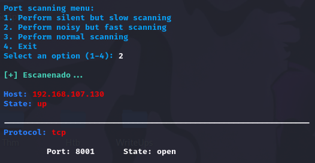

# PortScanner

Python script that performs a scan of open ports on a specific IP address.

Permissions must be given or the script must be run as sudo for it to work properly.

# Necessary dependences

* Nmap: pip install python-nmap
* Pyfiglet: pip install pyfiglet

# PortScanner

First, we execute the script indicating the IP address of the machine, otherwise the script will not be executed.

-----------------------------------------------

Once executed, by entering an IP address, you will be presented with a menu that will allow you to choose between two options. The first option will perform a scan of the open ports only, while the second option will perform a scan of the open ports and obtain information about the versions of the services associated with those ports.

For both options, choosing each option brings up another menu that allows you to specify whether you prefer to perform a quieter but slower scan, a faster but noisier scan, or opt for a normal scan.

As a last detail, after completing an exclusive scan of the open ports, a message appears offering the option to perform a more complete scan. If you accept this option, you will access the corresponding menu to perform the port and version scan.

If you choose to scan only the open ports, the report will be presented directly. On the other hand, if you opt for a more complete scan, the report will be saved to a file.

